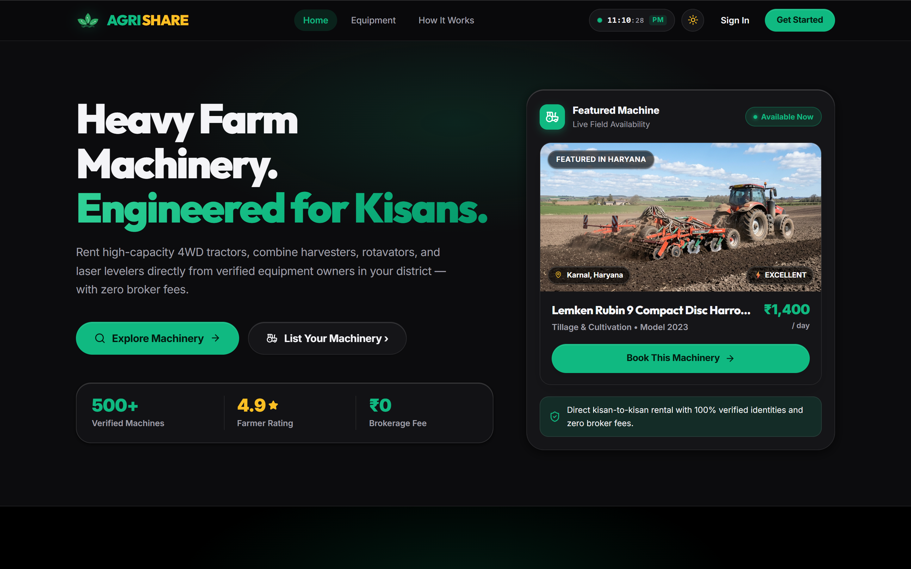
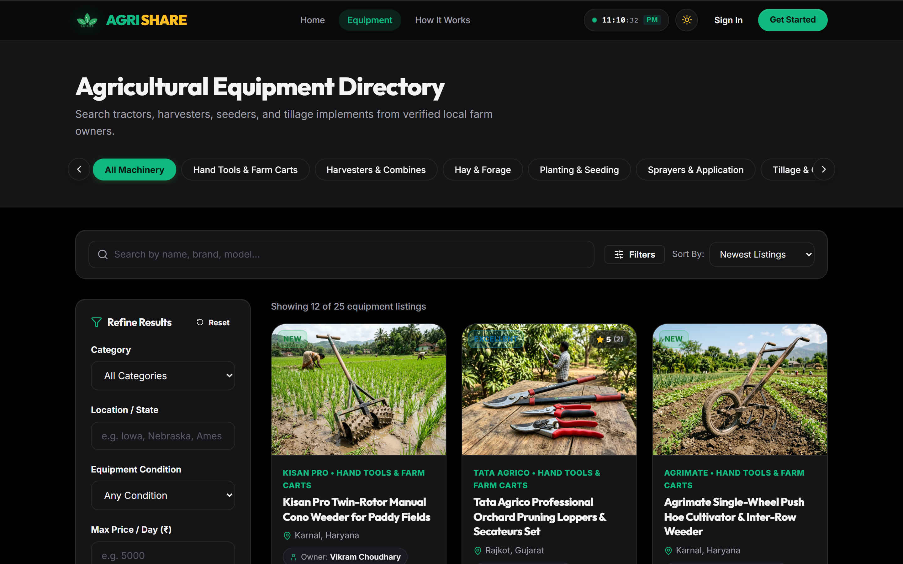
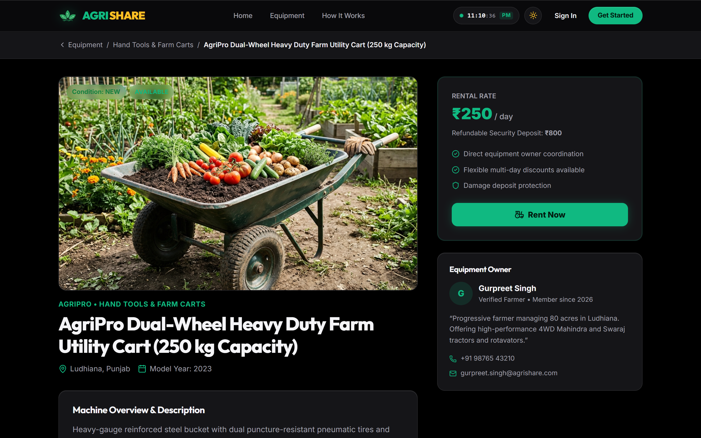
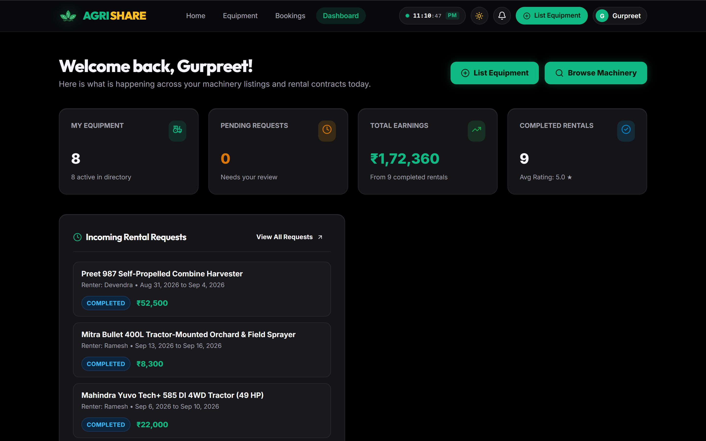
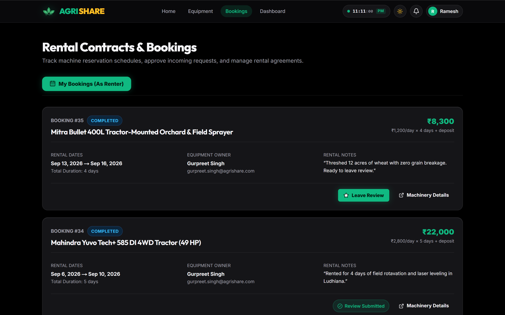
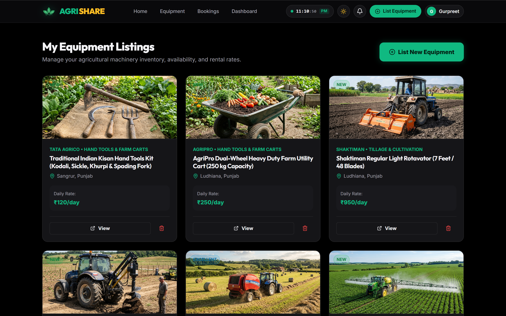
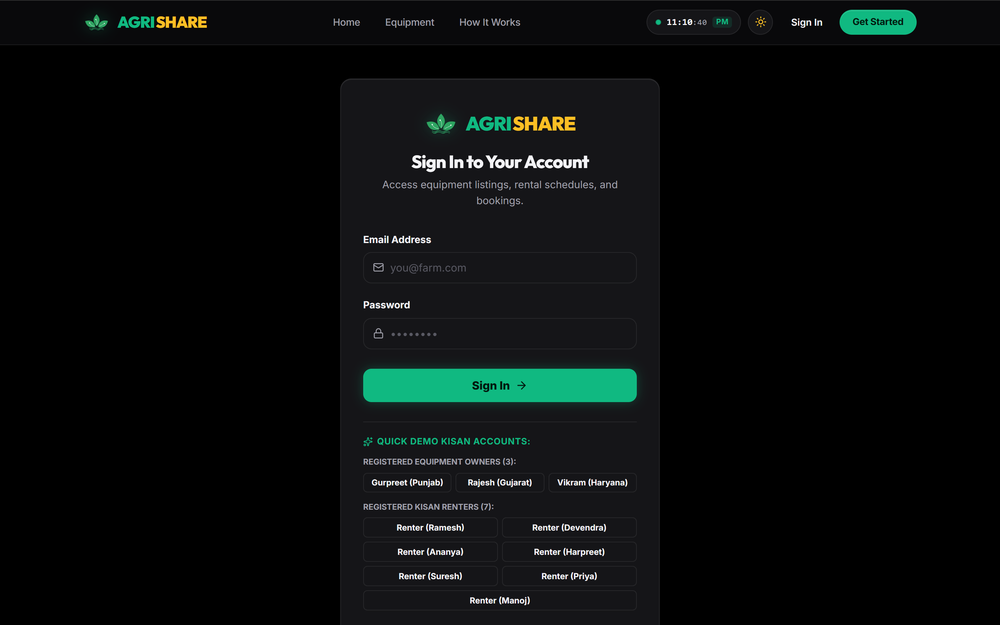
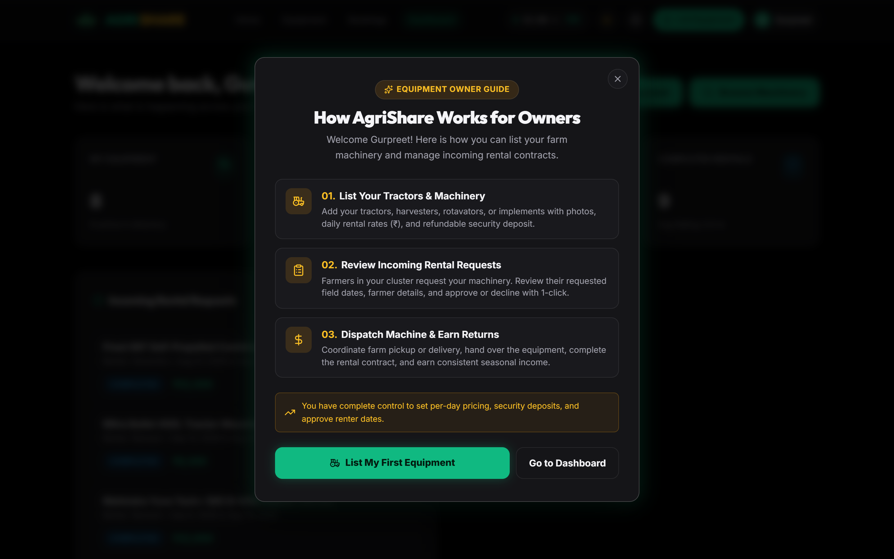
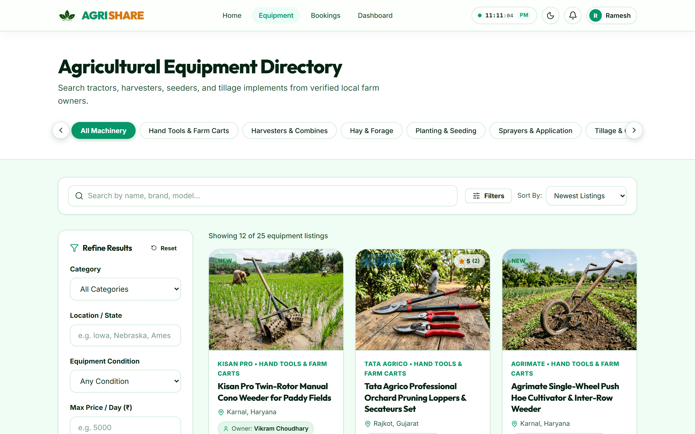

  

   
   

  

   

  
  
  
  

   
   
  

 

**AgriShare** is a modern web-based agricultural equipment rental platform that connects farmers who need machinery with equipment owners who want to rent out their idle machines.

The platform makes agricultural machinery more accessible by allowing farmers to find, compare, and book equipment locally without the need to purchase expensive machinery or depend on middlemen.

 

📌 Project Status

Milestone| Description| Status
Backend & Authentication| Django, DRF, JWT, Custom User Model| ✅ Completed
Equipment Catalog| Categories, search, filters, sorting & pagination| ✅ Completed
Booking System| Pricing, availability & approval workflow| ✅ Completed
Reviews & Notifications| Verified reviews, ratings & notifications| ✅ Completed
Role-Based Dashboard| Owner & renter analytics| ✅ Completed
Next.js Frontend| Modern responsive frontend with App Router| ✅ Completed
Indian Localization| INR, Indian machinery & locations| ✅ Completed
Automated Testing| Unit tests & end-to-end testing| ✅ Completed

Current status: Fully functional MVP with automated testing.

---

## 🖼️ Application UI Showcase & Screenshots

AgriShare features a production-ready, ultra-responsive web interface styled with modern agricultural aesthetics, including dual **Dark / Light mode** support, live equipment search, responsive cards, and role-based workflows for both equipment owners and renters.

### 🌟 1. Homepage & Platform Overview
> Dynamic hero section showcasing verified farm machinery, live district-level equipment availability, and real-time kisan metrics.

  

 

### 🚜 2. Agricultural Machinery Marketplace & Directory
> Full catalog search with category pills (Tractors, Combines, Tillage, Seeders), condition filters, district search, and maximum daily rental rates in Indian Rupees (₹).

  

 

### 🔍 3. Equipment Specifications & Booking Request Flow
> Transparent machine profile displaying high-definition photos, technical specs, manufacturing year, verified owner profile, and transparent daily rental + refundable security deposit breakdown.

  

 

### 👥 4. Role-Based Dashboards & Rental Operations

<table>
  <tr>
    <td width="50%" align="center">
      <b>🚜 Equipment Owner Dashboard</b> 
      Total earnings in ₹, fleet overview, active listings & incoming requests  
      
    </td>
    <td width="50%" align="center">
      <b>📋 Renter Booking Contracts & Reviews</b> 
      Track reservation status (Pending, Approved, Completed) & leave verified ratings  
      
    </td>
  </tr>
  <tr>
    <td width="50%" align="center">
      <b>⚙️ Machinery Inventory Management</b> 
      Manage farm machinery, per-day rental rates, and real-time machine availability  
      
    </td>
    <td width="50%" align="center">
      <b>🔑 Authentication & Quick Demo Kisan Accounts</b> 
      Secure JWT authentication with 1-click preset login for Punjab, Gujarat & Haryana kisans  
      
    </td>
  </tr>
  <tr>
    <td width="50%" align="center">
      <b>✨ Interactive Kisan Onboarding Guide</b> 
      Step-by-step guided modal helping first-time farmers and machinery owners onboard  
      
    </td>
    <td width="50%" align="center">
      <b>☀️ Agricultural Light Theme</b> 
      Clean, daylight-optimized theme designed for outdoor sunlight readability in the field  
      
    </td>
  </tr>
</table>

 

🌾 Why AgriShare?

Agricultural machinery can be expensive to purchase and may remain unused for long periods.

AgriShare solves this problem by creating a rental marketplace where:

👨‍🌾 Farmers / Renters

- Find machinery when they need it
- Compare equipment and rental prices
- Book equipment for specific dates
- Avoid the high cost of purchasing machinery

🚜 Equipment Owners

- List tractors and agricultural implements
- Earn money from unused machinery
- Manage rental requests
- Track bookings and earnings

 

✨ Key Features

🔐 Authentication

- Custom Django User model
- Email-based authentication
- JWT access & refresh tokens
- Automatic token refresh
- User registration and login
- Profile management
- Secure password change

---

🚜 Equipment Marketplace

Users can browse agricultural machinery and search for equipment using:

- Machine name
- Brand
- Model
- Location
- Category
- Condition
- Availability status
- Maximum daily rental price

Sorting Options

- Newest listings
- Price: Low → High
- Price: High → Low
- Name

Equipment owners can also:

- Add equipment
- Upload multiple images
- Edit listings
- Delete listings
- Manage their equipment inventory

---

📅 Booking & Rental System

AgriShare includes a complete rental workflow.

Booking Flow

Renter
  │
  ▼
Select Equipment
  │
  ▼
Choose Rental Dates
  │
  ▼
Booking Request
  │
  ▼
Equipment Owner
  │
  ├── Approve ──► Rental
  │
  └── Reject

Booking Rules

The backend automatically:

- Calculates the rental price
- Prevents overlapping bookings
- Prevents users from renting their own equipment
- Validates rental dates
- Handles booking approval and rejection

Price Calculation

Total Amount =
(Rental Price × Number of Days) + Security Deposit

Booking Status

PENDING
   ↓
APPROVED
   ↓
COMPLETED

Bookings can also be:

PENDING / APPROVED → CANCELLED
PENDING → REJECTED

---

⭐ Reviews & Ratings

Only renters who have completed a booking can submit a review.

Features include:

- 1–5 star ratings
- Written reviews
- One review per completed booking
- Verified rental reviews
- Automatic equipment rating calculation

This helps farmers identify reliable equipment and owners.

---

🔔 Notifications

Users receive in-app notifications for important events such as:

- New booking requests
- Booking approvals
- Booking rejections
- Booking cancellations
- Completed rentals
- New reviews

Notifications can be marked as read individually or all at once.

---

📊 Role-Based Dashboard

AgriShare provides different dashboards depending on the user's role.

🚜 Equipment Owner

Owners can view:

- Total earnings
- Active equipment listings
- Rental activity
- Pending booking requests
- Booking statistics
- Inventory

👨‍🌾 Renter

Renters can view:

- Total expenditure
- Current bookings
- Booking history
- Pending requests
- Rental activity

  

---

🎨 Frontend

The frontend uses a clean, modern flat UI designed around agricultural colors.

UI Features

- 🌞 Light mode
- 🌙 Dark mode
- 📱 Responsive layouts
- 🟩 Forest Green primary color
- 🟨 Harvest Amber accent color
- Solid cards and components
- Responsive navigation drawer
- Interactive booking and review modals

Design System

Primary Green  → #236f41
Harvest Amber  → #d97706

Heading Font  → Outfit
Body Font     → Inter

  

---

🛠️ Tech Stack

Frontend

Technology| Purpose
Next.js 16+| React framework
TypeScript| Type safety
Vanilla CSS| UI styling
Lucide React| Icons
Context API| Authentication & theme state
App Router| Application routing

Backend

Technology| Purpose
Django 5.1| Backend framework
Django REST Framework| REST API
SimpleJWT| Authentication
django-filter| Filtering
drf-spectacular| API documentation
django-cors-headers| CORS handling
Pillow| Image processing

Database

Development → SQLite
Production  → PostgreSQL

---

📁 Project Structure

AgriShare uses a monorepo structure.

AgriShare/
│
├── backend/
│   ├── manage.py
│   ├── requirements.txt
│   │
│   ├── config/
│   │   ├── settings/
│   │   │   ├── base.py
│   │   │   ├── development.py
│   │   │   └── production.py
│   │   ├── urls.py
│   │   ├── wsgi.py
│   │   └── asgi.py
│   │
│   └── apps/
│       ├── accounts/
│       ├── equipment/
│       ├── bookings/
│       ├── reviews/
│       ├── notifications/
│       └── dashboard/
│
├── frontend/
│   ├── app/
│   ├── components/
│   ├── context/
│   ├── services/
│   ├── lib/
│   ├── public/
│   └── types/
│
├── scripts/
│   └── test_e2e_flow.py
│
├── README.md
├── .gitignore
└── LICENSE

---

🚀 Getting Started

Prerequisites

Make sure the following are installed:

- Python 3.12+
- Node.js 18+
- npm
- Git

---

⚙️ Backend Setup

1. Open the backend directory

cd backend

2. Create a virtual environment

Windows

py -3.13 -m venv venv
.\venv\Scripts\Activate.ps1

macOS / Linux

python3 -m venv venv
source venv/bin/activate

3. Install dependencies

pip install -r requirements.txt

4. Configure environment variables

cp .env.example .env

«On Windows, you can also manually copy ".env.example" to ".env".»

5. Run migrations

python manage.py migrate

6. Add demo data

python manage.py seed_data

This creates demo users, equipment categories and agricultural machinery.

7. Start the backend

python manage.py runserver 127.0.0.1:8000

Backend:

http://127.0.0.1:8000

---

💻 Frontend Setup

Open another terminal.

1. Navigate to frontend

cd frontend

2. Install dependencies

npm install

3. Start development server

npm run dev

Frontend:

http://localhost:3000

4. Check production build

npm run build

---

🔑 Demo Accounts

AgriShare includes ready-to-use demo accounts for testing.

Role| Email| Password| Location
Admin| "admin@agrishare.com"| "admin12345"| New Delhi
Owner| "gurpreet.singh@agrishare.com"| "password123"| Ludhiana, Punjab
Owner| "rajesh.patel@agrishare.com"| "password123"| Rajkot, Gujarat
Owner| "vikram.choudhary@agrishare.com"| "password123"| Karnal, Haryana
Renter| "ramesh.sharma@agrishare.com"| "password123"| Indore, MP

⚡ Quick Login

The login page also contains one-click demo login buttons for easier testing.

«Important: These credentials are for local/demo use only. Do not use them in production.»

---

🚜 Sample Indian Machinery

AgriShare comes with realistic agricultural equipment data.

Equipment| Category| Location| Daily Rate| Deposit
Mahindra Yuvo Tech+ 585 DI| Tractor| Ludhiana, Punjab| ₹2,800| ₹8,000
Swaraj 855 FE| Tractor| Sangrur, Punjab| ₹2,500| ₹7,500
Preet 987 Combine Harvester| Harvester| Karnal, Haryana| ₹6,500| ₹20,000
Shaktiman Rotavator| Tillage| Indore, MP| ₹1,400| ₹4,000
John Deere 5310| Tractor| Rajkot, Gujarat| ₹3,200| ₹9,000
Dasmesh 912 Super Seeder| Seeding| Bathinda, Punjab| ₹2,200| ₹6,000
Lemken Opal 090 Plough| Tillage| Nashik, Maharashtra| ₹1,600| ₹5,000
Fieldking Multi-Crop Thresher| Threshing| Guntur, Andhra Pradesh| ₹1,800| ₹5,000

---

📚 API Documentation

AgriShare provides interactive API documentation using Swagger / OpenAPI.

Once the backend is running:

Swagger UI

http://127.0.0.1:8000/api/docs/

OpenAPI Schema

http://127.0.0.1:8000/api/schema/

---

🔌 API Overview

Authentication

POST   /api/auth/register/
POST   /api/auth/login/
POST   /api/auth/token/refresh/
GET    /api/auth/profile/
PUT    /api/auth/profile/
POST   /api/auth/change-password/

Equipment

GET    /api/equipment/
POST   /api/equipment/
GET    /api/equipment/{id}/
PUT    /api/equipment/{id}/
DELETE /api/equipment/{id}/
GET    /api/equipment/categories/
GET    /api/equipment/my_equipment/

Bookings

POST   /api/bookings/
GET    /api/bookings/my_rentals/
GET    /api/bookings/incoming_requests/
POST   /api/bookings/{id}/approve/
POST   /api/bookings/{id}/reject/
POST   /api/bookings/{id}/cancel/
POST   /api/bookings/{id}/complete/

Reviews

POST   /api/reviews/
GET    /api/reviews/?equipment={id}

Notifications

GET    /api/notifications/
POST   /api/notifications/{id}/read/
POST   /api/notifications/mark_all_read/

Dashboard

GET    /api/dashboard/stats/

---

🧪 Testing

AgriShare includes automated backend and integration tests.

Django Unit Tests

The project currently contains 19 unit tests.

cd backend

python manage.py test

Expected result:

Ran 19 tests
OK

---

🔄 End-to-End Test

The project also includes an automated integration flow covering the main application workflow.

Make sure the Django server is running first.

python scripts/test_e2e_flow.py

Expected result:

10 / 10 steps passed
100% success

---

🏗️ Production Deployment

AgriShare is structured to support production deployment.

Before deploying:

Backend

- Set "DJANGO_ENV=production"
- Set "DEBUG=False"
- Use PostgreSQL
- Configure production secrets
- Configure CORS and CSRF
- Run database migrations
- Run "collectstatic"

Media Storage

For production equipment images, use a dedicated storage service such as:

- AWS S3
- Cloudinary

Backend Server

Recommended setup:

Internet
   │
   ▼
Nginx
   │
   ▼
Gunicorn / Uvicorn
   │
   ▼
Django + DRF
   │
   ▼
PostgreSQL

Frontend

The Next.js frontend can be deployed using:

- Vercel
- Docker
- Other Node.js-compatible hosting platforms

Set:

NEXT_PUBLIC_API_URL=https://api.example.com/api

---

🔒 Security Considerations

For production deployment, make sure to:

- Disable Django "DEBUG"
- Use strong secret keys
- Never commit ".env" files
- Use HTTPS
- Configure CORS correctly
- Configure CSRF trusted origins
- Use PostgreSQL
- Store media files outside the application server
- Use secure JWT configuration
- Rotate production credentials regularly

---

🗺️ Future Improvements

Possible future versions of AgriShare could include:

- 📍 GPS-based equipment discovery
- 🗺️ Interactive map search
- 💳 Online payments
- 📱 Mobile application
- 💬 Owner–renter messaging
- 📸 Equipment verification
- 🪪 KYC verification
- 🤖 AI-based equipment recommendations
- 📈 Advanced owner analytics
- 🔔 Push notifications
- 🌐 Multi-language support for Indian languages
- 🧑‍🌾 Farmer-specific recommendations based on crop and season

---

📄 License

AgriShare is licensed under the MIT License.

See the "LICENSE" file for more information.

---

🌾 AgriShare

«Making agricultural machinery more accessible, one rental at a time. 🚜»

Built with Django + Django REST Framework + Next.js + TypeScript.